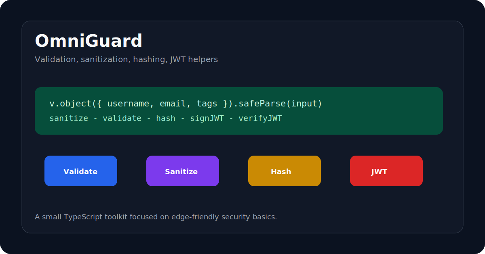

# OmniGuard

Zero-dependency validation, sanitization, hashing, and JWT helpers for TypeScript.



OmniGuard is a compact security utility library built around native Web APIs. It combines a Zod-like validation surface, basic sanitization helpers, hashing, and JSON Web Token signing/verification in one tree-shakable package.

## Why This Exists

Small apps and edge runtimes often need security basics without pulling several dependencies:

- validation schemas
- HTML stripping and escaping
- hashing through Web Crypto
- JWT signing and verification
- browser/edge-friendly primitives

OmniGuard puts those pieces behind one consistent API.

## Highlights

- Fluent validators for strings, numbers, arrays, and objects
- `safeParse` style validation results
- Sanitization helpers such as `stripHtml` and `escape`
- Web Crypto based hashing
- JWT signing and verification
- Vitest coverage for validation, sanitization, and crypto helpers

## Example

```ts
import { crypto, v } from "omniguard";

const schema = v.object({
  username: v.string().stripHtml().min(3).max(20),
  email: v.string().email(),
  tags: v.array(v.string().escape()),
});

const result = schema.safeParse({
  username: "<b>onur</b>",
  email: "onur@example.com",
  tags: ["<script>alert(1)</script>"],
});

if (result.success) {
  const token = await crypto.signJWT({ sub: result.data.email }, "secret");
  const payload = await crypto.verifyJWT(token, "secret");
  console.log(payload);
}
```

## Development

```bash
npm install
npm test
npm run build
```

## Current Status

This is an early security toolkit and portfolio project. The next useful improvements are richer error formatting, more validators, and runtime compatibility examples.

## Recent Hardening

JWT verification now rejects expired tokens and tokens whose `nbf` claim is still in the future.

## Author

Onur Acar - <https://github.com/onuracar-dev>
